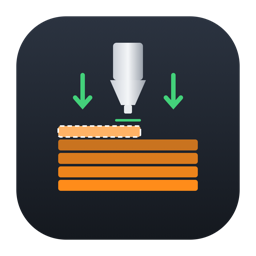
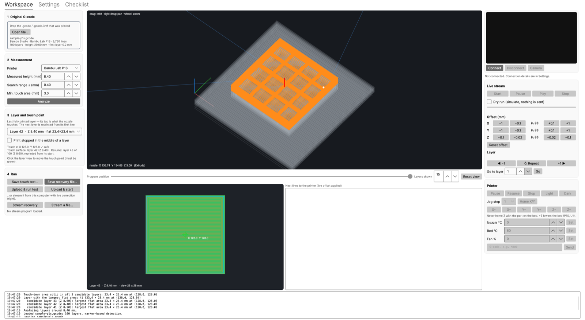
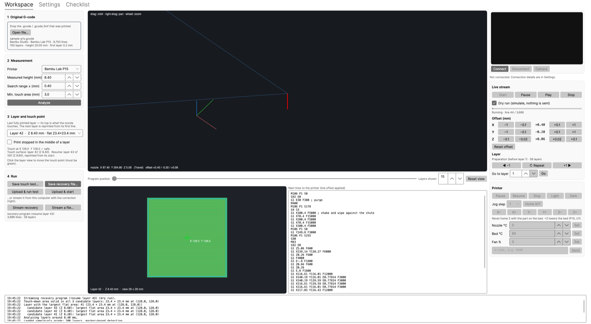

<p align="center"></p>

<h1 align="center">Gcode Recovery</h1>

<p align="center">
Resume a failed 3D print (filament jam, runout or breakage) on the part that is <b>still stuck to the bed</b>,<br>
using the printer's <b>load-cell / force sensor</b> to find the exact resume height.
</p>

<p align="center">
<b>Bambu Lab P1S</b> · <b>Snapmaker U1</b> · C# / .NET 10 · Avalonia (macOS, Windows, Linux) · MIT
</p>



---

## Why

A long print fails 20 hours in because the filament snapped. The part is still on the plate, exactly where it was
printed. The X/Y position is known; what is not known is the **Z height to resume at**. Calipers get you within a
few tenths of a millimetre, which is not good enough for a layer of 0.2 mm.

The P1S and the U1 can both *feel* when the nozzle touches something: the P1S has force sensors under the heatbed,
the U1 has a nozzle-contact probe. Gcode Recovery uses that sensor to touch the top of the part with a cold nozzle,
makes that contact point the Z reference, and resumes the original G-code from the right layer.

## How it works

1. **Measure** the part height roughly with calipers or a ruler (±0.5 mm is fine) and load the original
   `.gcode` or Bambu `.gcode.3mf`.
2. **Parse.** Layers are read from slicer markers (Bambu Studio, OrcaSlicer, Snapmaker Orca, PrusaSlicer, Cura) or,
   failing that, from Z motion. The **first-layer height is read from the file**, never hard-coded.
3. **Find a safe touch area.** Every layer within the search range is rasterised from its extrusion paths
   (line width aware, arcs linearised). The tool finds the largest rectangle that is **solid in every candidate
   layer**, so wherever the print actually stopped inside that range, the nozzle lands on extruded material, not
   on sparse infill or air. A minimum size (default 3 × 3 mm) and an edge margin are enforced. The per-layer
   largest flat areas are listed too, and you can click any other point that is green.
4. **Touch-down routine.** Bed at print temperature (so the part stays attached and true to size), nozzle
   cooled, X/Y homed, **Z never homed**. The nozzle moves over the touch point and descends slowly until the force
   sensor triggers. That position becomes the new Z reference (`G92`). The caliper value only narrows the search.
5. **Trim and shift.** Everything before the resume layer is discarded. The resume layer is printed **from its
   first line**, so a layer that stopped half-way is reprinted completely. All remaining Z values are shifted so
   the resume layer is printed like a first layer, at its own layer height above the touched surface, or optionally
   at the first-layer height from the G-code. A "keep original Z" mode is available for firmware with mesh fade.
6. **Reuse leveling.** No new leveling pass: the bed is occupied. Bambu keeps the mesh stored by the original
   print; Klipper reloads the `default` mesh profile.
7. **Purge and wipe** away from the part (P1S: purge chute and wiper; U1: bed corner farthest from the part),
   then restore temperatures, fans, tool, extrusion mode and extruder position, and continue.

Being one layer off with the caliper does not crash the nozzle: Z comes from the physical contact, so the
worst case is a part one layer taller or shorter.

## Features

| | |
|---|---|
| **Recovery program** | `.gcode` or `.gcode.3mf` output (Bambu archives are repacked with an updated `.md5`) |
| **Touch test** | Separate program that only performs the touch-down so you can check the behaviour first |
| **2D layer view** | Extrusion paths, the solid-in-all-candidates area (green), the touch rectangle and point. Click to choose |
| **3D preview** | Orbit/zoom/pan view of exactly what the printer will do next: touch-down (red), travels (blue), the next N layers (orange) over a ghost of the part on the bed, with a scrubber |
| **Live printer control** | Bambu LAN mode (MQTT, FTPS upload, port-6000 camera) and Klipper/Moonraker (HTTP + MJPEG): camera, status, pause/resume/stop, light, jog, temperatures, fan, G-code console, upload and start |
| **Live streaming with correction** | Stream the program from the computer and adjust **X/Y/Z offsets live** (applied to every line sent after the change and shown in the 3D view and the upcoming-lines list), **pause → measure → play**, **repeat the current layer**, **jump ±1 layer** or **go to any layer** (lifts first and restores the extruder position) |
| **Editable printer profiles** | Every added routine is a template with `{placeholders}`. Edit it in the app and save/load it as JSON |
| **Fullscreen workspace** | Everything for a recovery on one screen. Settings and checklist on separate tabs. F11 / Esc toggles fullscreen |



## How it differs from existing tools

There are several ways to resume a failed print today. Gcode Recovery is different from each of them in at least
one essential point (to the best of our knowledge as of October 2026):

| Existing approach | What it does | What Gcode Recovery does differently |
|---|---|---|
| Manual G-code editing ([CNC Kitchen guide](https://www.cnckitchen.com/blog/guide-resuming-a-failed-3d-print), forum how-tos) | Measure with calipers, delete lines before that height, home X/Y, set Z by hand | Automates all of it, and takes Z from a **load-cell contact** instead of the caliper value |
| Cura "resume at height" style plugins/scripts | Cut G-code at a typed-in height | Typed height only narrows the search; the real reference is **measured by the printer's force sensor** |
| [3DResumer](https://github.com/Temennigru/3DResumer) | Cuts G-code at a Z you find by jogging the nozzle down to the part yourself | The printer **probes the part automatically**, at a point that is **verified to be solid** in every candidate layer |
| OctoPrint print-recovery / power-loss plugins | Resume after a host/power interruption using a known position | Works after **mechanical** failures where the position is lost, on **Bambu** printers (no OctoPrint) and the **Snapmaker U1** |
| Firmware power-loss recovery | Resumes from a saved state after power loss | Does not need saved state; works when the firmware has already cancelled the job (jam, snap, runout) |
| Slicer "print from layer" features | Re-slice/print from a layer | Keeps the **original G-code and bed mesh**, no re-slicing, no re-leveling, with **live X/Y/Z correction and layer jumping** while streaming |

In short, it combines: automatic **safe touch-point search** in the G-code, **load-cell Z calibration on the part
itself**, reuse of the **original mesh**, a **3D preview** of the exact recovery motion, **live printer control**,
and **live offset / layer-jump correction**.

## Updates and anonymous community statistics

The app asks the community server (`https://gcode-recovery.dachstar.app`, configurable in Settings) whether a newer
release exists and shows a banner with a download link. With your consent (asked once, changeable in Settings) it
also counts, anonymously, **how much filament recoveries save** and **how many people use the app right now**.

| Sent | When | Contents |
|---|---|---|
| Update check | at start (can be disabled) | app version, platform |
| Heartbeat | every 5 min while open, only with consent | random number created at start-up (memory only, never saved), app version, platform |
| Job report | when a recovery **finished** (stream completed, or the printer reported the uploaded job as finished), only with consent | random job number (de-duplication), app version, platform, printer family (`bambu-p1s` / `snapmaker-u1` / `custom`), `stream`/`upload`, whole grams saved |

**Never sent:** G-code, file names, paths, printer IP / serial / access code, positions, layer data, user identifiers.
Touch tests and dry runs are never reported. Grams saved = filament in the layers that are already on the bed
(diameter and density from the slicer settings, defaults 1.75 mm / 1.24 g/cm³), computed locally.

The server ([`src/GcodeRecovery.Server`](src/GcodeRecovery.Server)) logs no requests, reads no IP addresses
(rate limiting is one global bucket), accepts only the fields above (each checked against an allow-list, bodies
≤ 2 KB) and stores only aggregates: per job the date (no time), version, platform, printer family, method and grams;
per day the peak number of concurrent users. The tests check that the database has no other columns. Public totals:
`/` and `/v1/stats`.

Self-hosting: `docker compose -f deploy/community-server/docker-compose.yml up -d --build` (listens on
`127.0.0.1:4090`; publish it with a Cloudflare Tunnel public hostname → `http://localhost:4090`), or
`scripts/deploy-community-server.sh user@host`.

## Install (macOS, Apple silicon)

1. Download `GcodeRecovery-<version>-macos-arm64.dmg` from
   [Releases](https://github.com/ddann/gcode-recovery/releases).
2. Open it and drag **Gcode Recovery** to **Applications**.
3. The app is ad-hoc signed, not notarized. The first time, right-click → **Open** (or run
   `xattr -dr com.apple.quarantine "/Applications/Gcode Recovery.app"`).
4. Allow local-network access when macOS asks (needed to talk to the printer).

Windows and Linux builds are produced by the CI workflow (`.github/workflows/build.yml`), or build them yourself
(below).

## Use

1. Read the **Checklist** tab first: don't move the part, don't home Z, clean the nozzle tip, load filament.
2. Open the file, enter the measured height, press **Analyze**, check the layer and touch point.
3. **Save touch test…** and run it (SD card, or **Upload & run test** when connected). Watch it.
4. **Save recovery file…** and run it, or **Stream recovery** to keep live control over X/Y/Z and layers.

Command line (handy for testing): `GcodeRecovery file.gcode --height 8.4 [--range 0.4] [--tab n] [--stream-dry]`.

### Printer notes

* **Bambu Lab P1S (experimental).** Bambu does not document its G-code. The touch-down uses `G380 S2` (move until
  the bed force sensors detect contact), as found in Bambu's own P1S start G-code. The stored mesh is used (no
  `G29`). Enable **LAN mode** (and LAN-only liveview for the camera); the IP, serial number and access code are on
  the printer screen. The access code is never written to disk.
* **Snapmaker U1 (Klipper fork).** Touch-down uses the nozzle-contact probe through
  `PROBE SAMPLE_TRIG_FREQ=450 SAMPLES=1` (the call the U1 firmware itself uses for bed contact).
  Klipper refuses Z moves until Z is homed, and Z must never be homed on the part, so there are two ways to give
  Klipper a Z position. The app checks the printer before streaming or uploading and offers the right one:
  1. **No Z homing at all (default):** X/Y are homed and a provisional Z is set with `SET_KINEMATIC_POSITION`.
     Klipper needs `[force_move] enable_force_move: True` for that. When the printer's config is writable over
     Moonraker, the app backs up `printer.cfg`, adds `[include custom/gcode_recovery.cfg]` and restarts Klipper,
     after asking you. On a stock U1 the config is read-only (advanced mode changes that); then add the two lines
     in Fluidd yourself.
  2. **Z home at the bed corner:** the U1 drops the bed to its bottom endstop and touches the bed at X10 Y10. This is
     offered only when that corner is at least 8 mm clear of the part (checked from the G-code), and the nozzle rises
     above the part before travelling to it. You can enable this in Settings.

  The mesh is reloaded with `BED_MESH_PROFILE LOAD=default`. Check the purge position for your setup.
* **Streaming to Bambu** uses MQTT `gcode_line`, paced by estimated motion time with a ~2 s lookahead, so offsets take
  effect within ~2 s. Moonraker executes each chunk before the next is sent.

> ⚠️ This software moves a machine with a heated nozzle next to a part you care about. Review the generated
> G-code and templates, run the touch test first, and stay at the printer. Use at your own risk.

## Build from source

Requires the [.NET 10 SDK](https://dotnet.microsoft.com/download).

```bash
dotnet test GcodeRecovery.sln                        # all tests (engine, server, privacy)
dotnet run --project src/GcodeRecovery.App           # run the app
scripts/package-macos.sh                              # macOS .app + DMG + zip into artifacts/
dotnet publish src/GcodeRecovery.App -c Release -r win-x64 --self-contained   # or linux-x64
python3 scripts/make-sample-gcode.py                  # regenerate examples/sample-p1s.gcode
```

## Project layout

```
src/GcodeRecovery.Core       UI-independent engine: G-code parsing, layer index, flat-area finder,
                             recovery planning/generation, 3D toolpath simulation, live streamer
src/GcodeRecovery.Printers   Printer connections: Bambu LAN (MQTT/FTPS/camera), Moonraker (HTTP/MJPEG)
src/GcodeRecovery.App        Avalonia desktop app (fullscreen workspace, 2D/3D views)
src/GcodeRecovery.Telemetry  Anonymous update/statistics contract + client (the complete list of what can be sent)
src/GcodeRecovery.Server     Community server: update checks, anonymous counters (ASP.NET Core + SQLite, Docker)
tests/                       xUnit tests for the core engine
scripts/                     packaging, icon rendering, sample generator
examples/                    sample-p1s.gcode to try the app without a printer
```

## Libraries used

* [Avalonia](https://avaloniaui.net/): cross-platform UI (MIT)
* [Bambu.NET](https://github.com/ColdThunder11/Bambu.NET): Bambu Lab LAN MQTT client (MIT), on [MQTTnet](https://github.com/dotnet/MQTTnet) (MIT)
* [FluentFTP](https://github.com/robinrodricks/FluentFTP): FTPS upload to the printer (MIT)

## License

MIT, see [LICENSE](LICENSE).
